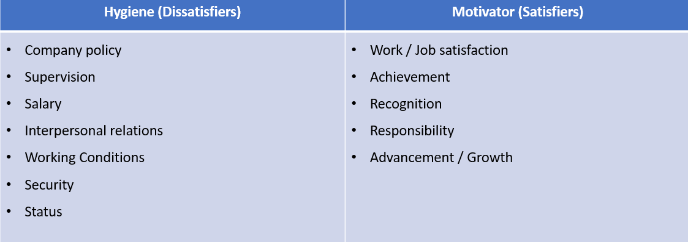

# innovation-project-II-dipo

innovation diploma

## leaders

Nick Wilton, tough but fair.
Always in and working before everyone else.
Honest and caring with a high attention to detail.

Eithne, honest.
Tough but logical.
Gets shit done.
Detail.

- tough
- fair
- honest
- logical
- passionate
- Honest
- intellegent
- very self assured and confident

-------------

## positive vs negative (theory x / theory y)

This theory in leadership discusses the idea that there are two ways to look at people:

### Theory X

- People dislike and do not want to be at work when possible.
- People need to be encouraged, incentivised, directed or even threatened to achieve.
- Do not want responsibility or have no ambition.

### Theory Y

- People are motivated and want to work.
- People desire self-direction and will accept and seek responsibility.
- People can express creativity and ingenuity to resolve problems within an organisation.

-------------

## Herzbergs Moticational Factors

## links

[Leadership Skills](https://www.thebalancecareers.com/top-leadership-skills-2063782)

[Forbs - Managing a Team](https://www.nytimes.com/guides/business/manage-a-successful-team)

[Leadership styles explainedLeadership styles explained](http://www.nwlink.com/~donclark/leader/leadstl.html)

[Herzberg's Theory and Applying it](https://www.aafp.org/pubs/fpm/issues/1999/1000/p26.html#:~:text=Frederick%20Herzberg%20theorized%20that%20employee,more%20productive%2C%20creative%20and%20committed.)

[Applying Herzberg's Theory](https://youtu.be/f-qbGAvR4EU?t=323)

-------------
